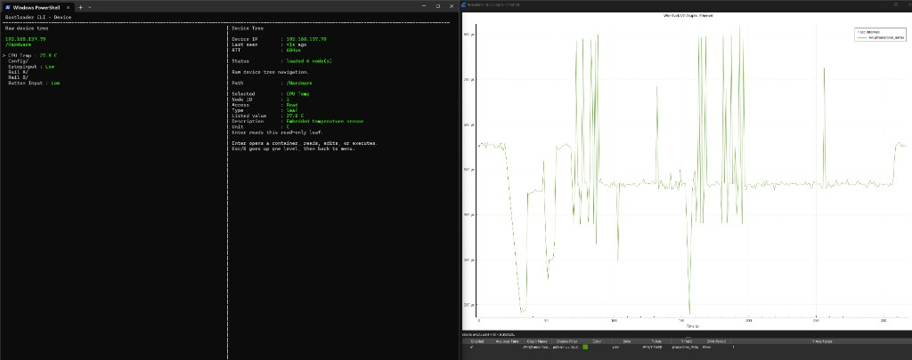

# Ethernet Resident Bootloader

Firmware and protocol for an **STM32F417** board with **LAN8720** Ethernet. A **resident image** always runs after reset: it owns the network stack (lwIP), FreeRTOS, flash programming, and a UDP control plane. **Application firmware** is a separate binary stored in flash, verified by the resident, copied into **CCMRAM**, and started through a narrow `AppApi` — not by remapping the vector table or jumping to an app reset handler.

## What this project is trying to achieve

| Goal | Approach | Status |
|------|----------|--------|
| Find devices on a LAN without knowing their IP | UDP broadcast discovery on a fixed port; devices reply unicast with MAC, IP, UID, and versions | ✅ |
| Configure and operate devices remotely | **Dynamic device tree**: the host discovers structure at runtime (`LIST`/`GET`/`SET`/`EXECUTE`); the loaded application registers its own subtree under `App/*` | ✅ |
| Update application firmware in the field | Enter programming mode via the tree, stream the image over **TCP** (1 KB chunks, SHA-1 verify), commit metadata only after success | ⚠️ (partially complete) |
| Update resident (bootloader) firmware in the field | Stage a new resident image and a dedicated **IAP app** into the **IAP app slot** (`0x08040000`); the resident loads that CCMRAM program, which erases/programs the protected resident sectors (`0x08000000`–`0x0803FFFF`) from RAM-safe flash helpers while not executing from the region being rewritten | Not started |
| Keep the device recoverable after a bad update | Resident stays in protected flash; invalid or missing apps do not brick discovery or re-flash | Not started |
| Let product code stay small and safe | Apps link for CCMRAM execution and call resident services (RTOS, net, GPIO, storage) through `AppApi` | Not started |

The design targets a **trusted private network** (lab, machine subnet, or VPN). Privileged actions (erase, program, reboot) are meant to be gated by **device-tree locks**; signed images and stronger credential handling are planned extensions (see [Security](#security)).

## How it fits together

```text
  Host (bootloader_cli.py / your tool)
      |  UDP broadcast          UDP unicast              TCP (when programming)
      v  DISCOVERY :45000       CONTROL :45001         dynamic port from tree
  +-------------------------------------------------------------+
  |  Resident firmware (flash 0x08000000, 256 KB)               |
  |  - VTOR / exceptions stay here                            |
  |  - ETH + lwIP + FreeRTOS                                  |
  |  - Device tree, flash manager, programming worker           |
  +-------------------------------------------------------------+
      |  validate AppImageHeader + SHA-1, copy to CCMRAM
      v
  +-------------------------------------------------------------+
  |  Application (stored 0x08040000, executes 0x10000000)       |
  |  - app_start(AppApi*) / optional app_stop()                 |
  |  - may register App/* device-tree nodes                    |
  +-------------------------------------------------------------+
```

**Resident** (`Firmware/Resident`, `Firmware/Protocol`, `Firmware/Boot`): always present; never erased by the field updater.

**Application** (`Firmware/Application`): example product image built with CMake, packaged as `.appimg`.

**IAP helper app** (`Firmware/IapApp`): separate CCMRAM image used for resident/bootloader self-update experiments (shares boot flash helpers).

**Cube bring-up** (`Firmware/Core`, `Firmware/LWIP`, HAL drivers): STM32Cube-generated init; `StartDefaultTask` calls `resident_main_task()`.

## Flash and memory layout

Defined in `Firmware/Boot/Inc/boot_memory_map.h` (STM32F417VG, 1 MB flash):

| Region | Address | Size | Role |
|--------|---------|------|------|
| Resident | `0x08000000` | 256 KB | Bootloader + networking + update logic (sectors 0–5) |
| App store | `0x08040000` | 640 KB | Persisted application image (sectors 6–10) |
| IAP app slot | `0x08040000` | 384 KB | Overlaps start of app store; used for IAP staging |
| Bootloader payload | `0x080A0000` | 256 KB | Staged resident/boot payload for self-update |
| Metadata | `0x080E0000` | 128 KB | Valid markers, settings, fault/disable flags |
| App execution (CCMRAM) | `0x10000000` | 64 KB | Where the resident copies and runs app code |

Single-bank flash constraints still apply: the resident must not erase sectors it is executing from; programming stops the app before touching the app store.

## Network services

| Service | Port | Protocol doc |
|---------|------|----------------|
| Discovery | **45000** (`DISCOVERY_PORT`) | [docs/discovery.md](docs/discovery.md) |
| Control / device tree | **45001** (`CONTROL_PORT`) | [docs/commands.md](docs/commands.md), [docs/device-tree.md](docs/device-tree.md) |
| Firmware programming | **Dynamic** (first free port ≥ 45002; exposed as `Program/Programming TCP port`) | [docs/programming.md](docs/programming.md) |

Wire format constants live in `Firmware/Protocol/Inc/proto_common.h` (magic `BLDR` / `0x424C4452`, `proto_version` 1, little-endian fields).

**Discovery requirements:** host and device must share the same **L2 broadcast domain** (VLAN/subnet). Send `DISCOVER_REQ` to `255.255.255.255` and/or directed broadcast; devices answer with `DISCOVER_REPLY` unicast to the sender. Use jitter and rate limiting when many devices share a switch.

## Device tree (dynamic, host-driven)

There is **no fixed product schema** baked into the protocol. The tree a host sees is **assembled at runtime** from whatever the resident and the **currently loaded application** expose. Tools such as `bootloader_cli.py` walk the tree with `LIST` and only show nodes that exist on that device in that moment (as in the [screenshot](#host-tools) under `/Hardware`, with live values like CPU temperature).

### Who defines what

| Layer | Role |
|-------|------|
| **Host** | Discovers the tree over UDP (`LIST` by node location bytes). Reads and writes leaves, runs actions, and unlocks protected subtrees. It does not need hardcoded paths for app-specific settings—only the resident’s core branches are stable across products. |
| **Resident** | Owns the always-present skeleton: `Network/*`, `Program/*`, `Hardware/*`, `Debug/*`, `Reboot`, and the `App` mount point. Also rebuilds **metadata-backed** nodes (e.g. persisted settings under `Debug`) when stored keys change. |
| **Loaded application** | After `app_start()`, registers a named mount under **`App/*`** via `AppApi` (`mount`, `set_value`, `register_action`). Product-specific parameters, actions, and labels live here and differ per `.appimg`. |

### Lifecycle

- **App running:** resident nodes + whatever the application mounted under `App/*`.
- **Programming mode:** the resident stops the app, **unmounts** all application nodes, and only resident/programming nodes remain—so the host always talks to a consistent tree during flash updates.
- **App restarts:** the application rebuilds its subtree (defaults unless it restores persisted values itself).

Wire encoding (`LIST` / `GET` / `SET` / `EXECUTE` / `UNLOCK`, access bytes, locking) is in [docs/device-tree.md](docs/device-tree.md). Human-readable paths in docs (e.g. `Network/IPv4 address`) are illustrations; packets use compact **node location** bytes, not path strings.

## Application image format

Apps are built for **CCMRAM** (`0x10000000`) with a packaged header (`Firmware/AppAbi/app_image.h`):

- Magic `APP1`, ABI version 1
- **SHA-1** digest over payload bytes (HASH peripheral on device)
- Entry via `app_start(const AppApi *api)`; optional `app_stop()` before flash erase

CMake produces `example_app.elf`, `.bin`, and `.appimg` (and the same for `iap_app`).

## Security

| Topic | Current implementation | Planned / documented |
|-------|------------------------|-------------------|
| Transport | Plain UDP/TCP on LAN | Assumes private network |
| Privileged ops | Device-tree lock domains + `UNLOCK` | See [docs/device-tree.md](docs/device-tree.md) |
| Programming gate | Stub always allows programming (`resident_security.c`) | Session/time-limited unlock |
| Image integrity | **SHA-1** verify before marking app valid | Optional ECDSA/Ed25519 (capability bit reserved) |

Factory provisioning should still assign a **unique MAC** and sane default IP settings before relying on discovery in production.

## First-time / factory programming

Network discovery and UDP updates only work after the **resident** image is programmed (SWD/JTAG, ST-LINK, etc.). Optional steps:

1. Flash resident into `0x08000000` (STM32CubeIDE project under `Firmware/`, target **STM32F417VGTx**).
2. Optionally flash an initial `.appimg` or leave app store empty and install later over TCP.
3. Configure option bytes if you need write-protection on resident sectors or a production RDP level (trade off against debug access).
4. Provision MAC and default network values (device tree or metadata defaults).

**Bring-up checklist**

- [ ] Resident boots; `SCB->VTOR` remains on resident vectors
- [ ] LAN8720 link up; lwIP running
- [ ] Host receives `DISCOVER_REPLY` on the LAN
- [ ] Device tree readable; locked nodes reject writes until unlocked
- [ ] App start/stop and programming flow succeed with a test `.appimg`

## Building

### Application images (CMake)

From the repository root:

```bash
cmake --preset arm-debug
cmake --build --preset build-debug
```

Outputs (under `build/arm-debug/Firmware/Application/` and `.../IapApp/`):

- `example_app.elf`, `example_app.bin`, `example_app.appimg`
- `iap_app.elf`, `iap_app.bin`, `iap_app.appimg`

**Prerequisites:** CMake 3.22+, Python 3, `arm-none-eabi-gcc` / `objcopy` / `nm` / `size` on `PATH` (or set `ARM_GCC_ROOT` to the toolchain root). On Windows, use the `arm-vs2022` preset if NMake is not available:

```bash
cmake --preset arm-vs2022
cmake --build --preset build-vs2022
```

Release: `arm-release` / `build-release`.

### Resident firmware (STM32CubeIDE)

The full resident image is built as the **Bootloader** Cube project in `Firmware/` (not yet wired into root CMake). Open the project in STM32CubeIDE or use the generated Makefile; linker script `STM32F417VGTX_FLASH.ld` (resident size must stay within 256 KB).

## Host tools



*Left: `bootloader_cli.py` connected to a device (e.g. `192.168.137.79`), browsing `/Hardware` and reading live values such as CPU temperature. Right: Wireshark I/O graph of frame timing for traffic on the same segment.*

| Tool | Purpose |
|------|---------|
| [tools/bootloader_cli.py](tools/bootloader_cli.py) | Interactive discovery, device tree, and programming |
| [tools/test_discovery.py](tools/test_discovery.py) | Discovery smoke test |
| [tools/test_control_tree.py](tools/test_control_tree.py) | Device-tree protocol test |

Example:

```bash
python tools/bootloader_cli.py --bind 192.168.1.99 discover
```

## Documentation map

| Document | Contents |
|----------|----------|
| [docs/README.md](docs/README.md) | Protocol index and conventions |
| [docs/discovery.md](docs/discovery.md) | `DISCOVER_REQ` / `DISCOVER_REPLY` |
| [docs/commands.md](docs/commands.md) | UDP control channel |
| [docs/device-tree.md](docs/device-tree.md) | Node model and operations |
| [docs/programming.md](docs/programming.md) | TCP programming stream |
| [docs/firmware.md](docs/firmware.md) | Resident/app architecture plan |

## Cortex-M ownership rules

- Resident owns **VTOR**, SysTick, PendSV, SVC, Ethernet IRQ/DMA, and global HAL init.
- The application must not assume reset-to-main ownership; use `AppApi` for RTOS, network, and hardware.
- Updates **stop** the app (and unmount `App/*` nodes) before erasing app flash.

## Still open / in progress

- Tighten programming security (non-stub unlock, optional signing)
- Split resident linker script to hard 256 KB and metadata symbols in IDE build
- LAN8720 RMII clocking and pin map (board-specific; see Cube ETH config)
- Auto-start app after successful programming (today may leave `Program/State` at `Stopped`)

For architecture rationale and module breakdown, see [docs/firmware.md](docs/firmware.md).
