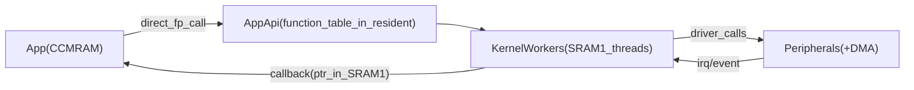

## AppApi call gateway

Define a robust calling convention for App<->Kernel interactions using the existing `AppApi` function-table, with kernel-owned DMA-safe buffers in SRAM1 and safe callback delivery back into the App in CCMRAM.

## Goals
- Keep **App image entirely in CCMRAM** (64KB at `0x10000000`) using the existing app linker script.
- Keep **kernel/resident code + drivers + `AppApi` table** in resident image (Flash + SRAM1 at `0x20000000`).
- Provide a clear, consistent way to do:
  - **App -> Kernel** API calls (sync and async)
  - **Kernel -> App** callbacks/events
- Ensure **no DMA uses CCMRAM pointers** (stage/copy to SRAM1 when needed).

## Current facts from repo
- `AppApi` interface is defined in `[Firmware/AppAbi/app_api.h](../Firmware/AppAbi/app_api.h)`.
- `AppApi` is instantiated and populated in `[Firmware/Resident/Src/resident_api.c](../Firmware/Resident/Src/resident_api.c)` as `static AppApi g_app_api;`.
- The application is linked fully into CCMRAM via `[Firmware/Application/app_linker.ld](../Firmware/Application/app_linker.ld)`.
- Memory regions and app exec base are defined in `[Firmware/Boot/Inc/boot_memory_map.h](../Firmware/Boot/Inc/boot_memory_map.h)` (`BOOT_APP_EXEC_BASE_ADDR == 0x10000000`).

## Proposed call model
### 1) App -> Kernel synchronous calls (direct function pointers)
- Keep the current model: `AppApi` contains **function pointers into resident code**.
- **Rule**: any `AppApi` function that can touch a peripheral driver must treat pointers from the app as **CPU-readable only**, not DMA-safe.
- For pointer parameters:
  - If the operation may use DMA (or uses a driver that does), the kernel implementation must **copy into SRAM1 staging buffers** before starting the operation.
  - If the operation is purely CPU/PIO (no DMA), kernel may read from CCMRAM directly.

### 2) App -> Kernel asynchronous requests (optional but recommended)
For operations that shouldn’t block app threads or that require driver-thread context:
- Introduce a **kernel-owned request queue** (in resident SRAM1) per subsystem (net/uart/device_tree) or a shared dispatcher.
- Add API methods (or repurpose existing ones if already async) to enqueue requests and return quickly.
- Kernel worker tasks process the queue and interact with peripherals.

### 3) Kernel -> App callbacks
- Keep callbacks as **function pointers provided by the app**, called by kernel worker threads.
- **Rule**: callback arguments must be **stable for the duration of the callback**.
  - For RX payloads (UDP/UART): kernel passes pointer to a **kernel-owned SRAM1 buffer** that remains valid until callback returns.
  - If the app needs to keep data, it must copy it.
- **Rule**: callbacks must not run in IRQ context.
  - ISR/driver code signals a kernel thread (queue/notification), and that thread invokes the callback.

## Memory ownership and DMA safety
### Regions
- App code/data: CCMRAM `0x1000_0000..0x1000_FFFF`.
- Kernel heap/stacks/driver buffers: SRAM1 `0x2000_0000..0x2001_FFFF`.

### Pointer validation helpers
Add small helpers on the resident side (can reuse constants from `[Firmware/Boot/Inc/boot_memory_map.h](../Firmware/Boot/Inc/boot_memory_map.h)`):
- `bool ptr_in_app_ccmram(const void *p, size_t n)`
- `bool ptr_in_sram1(const void *p, size_t n)`
- Used to decide **copy/stage vs direct** and to fail fast on invalid pointers.

### Staging strategy (examples)
- **`net.send_udp(handle, ip, port, payload, len)`**:
  - Copy `payload` into a kernel TX buffer pool in SRAM1.
  - Perform lwIP/ETH send using that SRAM1 buffer.
- **`uart_write(id, data, len)`**:
  - If UART uses DMA: copy into SRAM1 staging, then start DMA.
  - If interrupt/PIO: can write directly from CCMRAM.
- **`uart_read` / `open_udp` receive callback**:
  - Receive into SRAM1 buffer; callback gets SRAM1 pointer.

## Concurrency and lifetime rules
- **AppApi is immutable** after `resident_api_init()`.
- For each handle type (`AppUdpHandle`, etc.), resident side owns the object; app only holds opaque handles.
- Define callback reentrancy rules:
  - callbacks may be invoked concurrently from different kernel worker threads unless serialized.
  - default recommendation: serialize callbacks per subsystem (e.g., net RX callbacks on one task).

## Error handling contract
- Standardize return values for all `int` APIs:
  - `0` success, negative error codes for invalid args, no resources, not initialized, etc.
- For async APIs, return immediately with `0` if enqueued, otherwise negative.

## Documentation artifact
Update/add a short ABI doc:
- Describe memory regions, DMA rules, callback lifetime rules, and thread/IRQ context rules.
- Reference the `AppApi` definition and any handle semantics.

## Diagram

## Rollout steps (safe, incremental)
- Start with **net + uart** since they are most DMA-sensitive.
- Add pointer-range helpers and TX/RX staging pools.
- Ensure all callbacks run from kernel threads (not ISR).
- Once stable, apply the same pattern to any other DMA-facing APIs.

## Files most likely touched
- `[Firmware/Resident/Src/resident_api.c](../Firmware/Resident/Src/resident_api.c)` (wiring any new methods / switching implementations)
- `[Firmware/Resident/Inc/resident_network.h](../Firmware/Resident/Inc/resident_network.h)` + its `.c` (UDP staging + callback thread context)
- `[Firmware/Resident/Inc/resident_hardware.h](../Firmware/Resident/Inc/resident_hardware.h)` + its `.c` (UART DMA staging decisions)
- `[Firmware/Boot/Inc/boot_memory_map.h](../Firmware/Boot/Inc/boot_memory_map.h)` (reuse constants for pointer-range checks)
- `[Firmware/AppAbi/app_api.h](../Firmware/AppAbi/app_api.h)` (only if adding async APIs / error codes)
