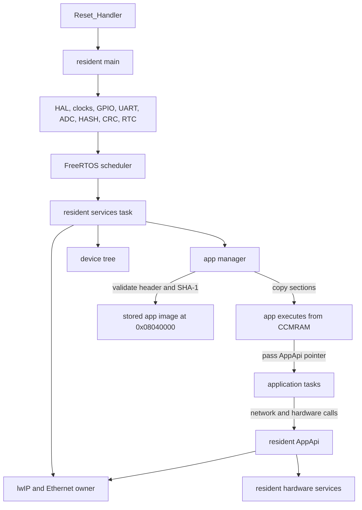

# Resident/App Firmware Structure Plan

## Baseline
The current tree is a single STM32Cube C firmware image under [`Firmware`](c:/Users/kleeuwkent/Documents/Personal/Ethernet-Bootloader/Firmware). It initializes HAL peripherals in [`Firmware/Core/Src/main.c`](c:/Users/kleeuwkent/Documents/Personal/Ethernet-Bootloader/Firmware/Core/Src/main.c), starts `defaultTask`, and calls `MX_LWIP_Init()`. lwIP currently hardcodes `10.0.0.2/24` in [`Firmware/LWIP/App/lwip.c`](c:/Users/kleeuwkent/Documents/Personal/Ethernet-Bootloader/Firmware/LWIP/App/lwip.c), and Ethernet ownership lives in [`Firmware/LWIP/Target/ethernetif.c`](c:/Users/kleeuwkent/Documents/Personal/Ethernet-Bootloader/Firmware/LWIP/Target/ethernetif.c). The default linker script still maps all 1 MB flash to one image in [`Firmware/STM32F417VGTX_FLASH.ld`](c:/Users/kleeuwkent/Documents/Personal/Ethernet-Bootloader/Firmware/STM32F417VGTX_FLASH.ld).

## Proposed Flash And RAM Layout
Use the STM32F417VG 1 MB flash sector boundaries so erase/program operations never touch resident code while it is running. The application image is stored in flash for persistence, then copied into CCMRAM before execution:

- Resident firmware: `0x08000000` to `0x0803FFFF`, sectors 0-5, 256 KB.
- Application image storage: `0x08040000` to `0x080DFFFF`, sectors 6-10, 640 KB.
- Metadata/settings: `0x080E0000` to `0x080FFFFF`, sector 11, 128 KB.
- SRAM resident/shared heap: `0x20000000` upward, managed by resident/FreeRTOS.
- Application execution region: `0x10000000` to `0x1000FFFF`, CCMRAM, 64 KB total. Reserve this for app `.text`, `.rodata`, `.data`, and `.bss` unless a later memory budget proves resident CCMRAM is required.
- App task stacks, queues, and dynamic objects should be allocated through resident RTOS API wrappers in normal SRAM, not by direct app heap ownership.

Create hardcoded address helpers in a dedicated module, not scattered literals:

- [`Firmware/Boot/Inc/boot_memory_map.h`](c:/Users/kleeuwkent/Documents/Personal/Ethernet-Bootloader/Firmware/Boot/Inc/boot_memory_map.h): address constants, sector ids, sizes, alignment checks.
- [`Firmware/Boot/Src/boot_memory_map.c`](c:/Users/kleeuwkent/Documents/Personal/Ethernet-Bootloader/Firmware/Boot/Src/boot_memory_map.c): helper methods such as `boot_mem_app_store_base()`, `boot_mem_app_store_limit()`, `boot_mem_app_exec_base()`, `boot_mem_app_exec_limit()`, `boot_mem_metadata_base()`, `boot_mem_is_app_store_range(addr,len)`, `boot_mem_is_app_exec_range(addr,len)`, `boot_mem_sector_for_addr(addr)`, and `boot_mem_is_resident_range(addr,len)`.

## Module Layout
Keep Cube-generated files mostly as board bring-up, then add resident-owned modules around them:

```text
Firmware/
  Core/                 Cube-generated startup, main, IRQ, peripheral init
  LWIP/                 Cube-generated lwIP/Ethernet integration
  Boot/
    Inc/, Src/
      boot_memory_map.*
      boot_image.*
      boot_app_manager.*
      boot_flash.*
      boot_metadata.*
      boot_fault.*
  Resident/
    Inc/, Src/
      resident_main.*
      resident_api.*
      resident_network.*
      resident_device_tree.*
      resident_hardware.*
      resident_security.*
  Protocol/
    Inc/, Src/
      proto_common.*
      proto_discovery_udp.*
      proto_control_udp.*
      proto_program_tcp.*
  AppAbi/
    app_api.h
    app_image.h
  Application/
    Inc/, Src/
      app_main.c
      app_linker.ld
```

## Resident/App Boundary
Define a fixed app image header at `APP_STORE_BASE = 0x08040000`. The resident validates this stored image, copies its loadable sections to `APP_EXEC_BASE = 0x10000000`, then calls the CCMRAM entrypoint.

- [`Firmware/AppAbi/app_image.h`](c:/Users/kleeuwkent/Documents/Personal/Ethernet-Bootloader/Firmware/AppAbi/app_image.h): `AppImageHeader` with magic, ABI version, stored image size, CCMRAM execution base, entry offset, loadable section metadata, SHA-1 digest, app version, and flags.
- [`Firmware/AppAbi/app_api.h`](c:/Users/kleeuwkent/Documents/Personal/Ethernet-Bootloader/Firmware/AppAbi/app_api.h): `AppApi` function table passed into `app_start(const AppApi *api)`.
- The app is linked to execute at `0x10000000` with its own linker script. Its binary is packaged with the app header and stored in the app flash storage region.
- The app does not own reset, VTOR, SysTick, PendSV, SVC, Ethernet IRQ, global HAL init, or any direct hardware handles.
- Before starting the app, `boot_app_manager` verifies the stored image with SHA-1, copies `.text`, `.rodata`, and initialized `.data` into CCMRAM, zeros app `.bss`, then calls the entrypoint from the validated header.
- To stop the app for programming, resident calls `app_stop()` if registered, waits for app tasks to exit, unmounts `app/*` device-tree nodes, then erases/programs only sectors 6-10.

## App Access Violation Policy
Treat application access violations as recoverable resident-managed faults. The resident should contain the failure, persistently disable the app, then reboot into resident-only mode so discovery, device-tree access, and programming remain available.

- Add [`Firmware/Boot/Inc/boot_fault.h`](c:/Users/kleeuwkent/Documents/Personal/Ethernet-Bootloader/Firmware/Boot/Inc/boot_fault.h) and [`Firmware/Boot/Src/boot_fault.c`](c:/Users/kleeuwkent/Documents/Personal/Ethernet-Bootloader/Firmware/Boot/Src/boot_fault.c) for fault classification and app-disable handling.
- In `MemManage_Handler`, `BusFault_Handler`, `UsageFault_Handler`, and `HardFault_Handler`, detect whether the faulting PC/LR is inside the CCMRAM app execution range.
- If the fault belongs to the application, write an `app_disabled` flag and fault reason into resident metadata/config, then request `NVIC_SystemReset()`.
- On next boot, `boot_app_manager` must refuse to start the app while `app_disabled` is set, but keep resident networking and the device tree online.
- Expose resident nodes such as `fw/app_disabled`, `fw/app_last_fault`, and a protected action such as `fw/enable_app` or `prog/clear_app_fault` so a host can inspect the reason, update/reflash the app, and explicitly re-enable it.
- If the fault is not attributable to the app execution range, keep the existing resident fail-stop behavior until a separate resident crash policy is defined.



## AppApi Hardware And Networking Hooks
Expose capabilities through function tables only. The application should not directly access HAL handles, peripheral registers, GPIO ports, Ethernet state, flash, or DMA-owned memory. Suggested groups:

- `AppApiRtos`: create/delete tasks, delay, mutexes, queues, uptime.
- `AppApiNet`: UDP open/send/close, optional TCP client/server wrappers, current IP/MAC getters, link status, and a safe way to register app protocol handlers.
- `AppApiDeviceTree`: mount/unmount app nodes under `app/*`, update values, register action callbacks.
- `AppApiHardware`: named board services such as 5V rail enable, output rail tristate control, expansion GPIO read/write, button/nESTOP read, UART/RS485 send/receive, ADC current-sense read.
- `AppApiStorage`: app settings read/write through resident metadata sector, not raw flash access.
- `AppApiLog`: resident-owned logging over UART or future UDP diagnostics.

Initial hardware services should wrap the existing generated symbols in [`Firmware/Core/Inc/main.h`](c:/Users/kleeuwkent/Documents/Personal/Ethernet-Bootloader/Firmware/Core/Inc/main.h), including `Enable_5V_Rail`, `Output_Rail_*_Tristate_Mode`, `Expansion_GPIO_*`, `Button_Input`, `nESTOP`, UART5/USART3/USART6, ADC1, CRC, HASH, and RTC. The app receives only logical service calls and opaque handles issued by the resident.

## Resident Runtime Services
Refactor `StartDefaultTask()` into a resident supervisor:

- Initialize settings/metadata.
- Load network config from device tree instead of hardcoded values in `MX_LWIP_Init()`.
- Start UDP discovery, UDP control, and TCP programming services.
- Build resident device-tree nodes: `device/*`, `net/*`, `fw/*`, `boot/*`, `prog/*`.
- Validate and start the app if metadata says the app is valid.
- Monitor lock timeouts, app health, link status, and update state.

## Programming Flow
Implement update code in phases:

- `PROG_BEGIN_REQ` requires unlock of the protected `prog/*` subtree.
- Resident stops the app and removes `app/*` nodes.
- TCP programming writes chunks of at most 1000 firmware bytes to the app region only.
- HASH peripheral SHA-1 verifies the final image. Keep the digest algorithm explicit in the app header so the ABI can reject unsupported images.
- Metadata valid marker is written only after verification succeeds.
- Resident restarts app or reboots, depending on a protocol flag.

## Build Structure
Use two linker scripts and two build targets:

- Resident target: modified `STM32F417VGTX_FLASH.ld` with `FLASH` length limited to 256 KB and metadata symbols exported.
- Application target: new app linker script with CCMRAM execution origin `0x10000000`, length 64 KB, and required `AppImageHeader` packaged into the stored flash image.
- Packaging step: produce an app update image whose header records the CCMRAM load address, entry offset, section sizes, and SHA-1 over the payload bytes that the resident will copy/execute.
- Shared headers: `AppAbi/*.h` only. The app must not include resident-private headers or Cube init files.

## Safety Rules
Enforce these invariants in code:

- No raw flash erase/program outside `boot_flash.*`.
- No app start unless header, flash storage range, CCMRAM execution range, ABI version, image size, and SHA-1 are valid.
- No app direct access to ETH IRQ/DMA, SysTick/PendSV/SVC, or VTOR.
- No direct app access to peripheral registers, HAL handles, DMA buffers, resident flash, app flash, or metadata flash.
- All app hardware and networking access goes through named resident services so ownership stays explicit.
- Any app-attributed access violation must persistently disable app autostart before rebooting, so the device does not enter a crash loop.