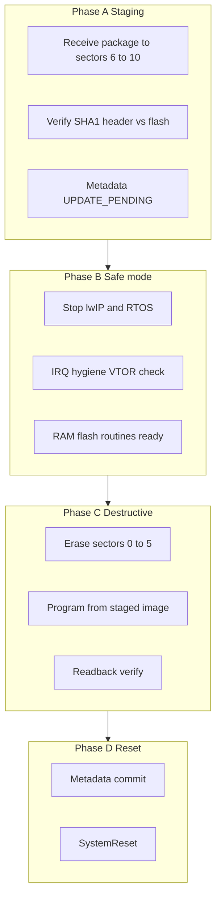

# Plan: Bootloader self-update via application region (STM32F4, internal flash)

This document is a **step-by-step engineering plan** for updating **bootloader sectors (0–5)** using a payload staged in **application sectors (6–10)** on an **STM32F4** device with **1 MB internal flash**. It assumes the **resident bootloader** normally chain-loads an application but does **not** rely on special bootloader cooperation beyond what normal boot + VTOR setup already provides.

**Related:** Application image programming is covered separately in [`programming_plan.md`](programming_plan.md). This plan addresses **rewriting the low flash regions** that contain the bootloader image itself.

---

## 1. Goals and non-goals

### Goals

- Ship a **single downloadable artifact** (or staged blob) into **sectors 6–10** that contains:
  - **New bootloader binary** (exact byte image for sectors 0–5), and/or
  - **Minimal updater logic** that performs erase/program/verify of sectors 0–5.
- Perform the destructive flash work **without executing instructions from sectors 0–5** while those sectors are being erased or programmed.
- After reset, boot **new bootloader** from **0x08000000** (or your configured boot base).
- Use **metadata in config flash** (your **sector 11** plan) so that after a bootloader update the device can **refuse to chain-load the application** until flags are validated—reducing the chance of a bad app+boot combo bricking field recovery.

### Non-goals (unless you explicitly add them later)

- Updating via **external QSPI** (this plan is **internal flash only**).
- Cryptographic **secure boot** / signature enforcement (can be layered on top).
- Zero brick risk under power loss without **either** a ROM bootloader path (DFU/UART) **or** a **dual-slot / golden-minimal** first stage.

---

## 2. Assumptions (verify against your exact part)

| Item | Your stated layout | Verification step |
|------|-------------------|-------------------|
| MCU | STM32F4, 1 MB | Confirm exact **part number** and **reference manual** flash organization table. |
| Bootloader image | **Sectors 0–5** | Sum sector sizes in RM; confirm total equals **256 KB** on typical F407-class maps (16+16+16+16+64+128). |
| Application / staging | **Sectors 6–10** | Confirm five × **128 KB** sectors (typical) = **640 KB** staging budget. |
| Config / metadata | **Sector 11** | Confirm sector size and whether **sector numbers** match RM (**many 1 MB F4 parts expose sectors 0–11 only**—resolve any “sector 13” references against the RM table). |
| Chain-load flag | Stored in metadata | Define exact **KV layout**, **defaults when erased**, and **CRC/version**. |

**Important:** sector numbering is **not interchangeable** across all STM32F4 derivatives; treat all sector indices as **project constants** backed by the RM print.

---

## 3. Hardware and CMSIS constraints (why RAM execution matters)

### 3.1 Execute-from-flash rule during mass erase / program

While **sectors 0–5** are **erased or being programmed**, the CPU **must not fetch instructions** from those addresses. Your running application lives in **sectors 6+**, so normal application code **can** continue to run **until** you decide to enter the **update critical section**.

However, ST flash programming drivers typically require:

- Critical timing/register sequences while flash interface is busy.
- Often **running flash programming routines from SRAM** (vendor examples and errata-dependent recommendations).

**Plan requirement:** Implement `bootloader_flash_apply()` (name arbitrary) such that **all** operations that call `FLASH_CR` programming paths for sectors 0–5 are executed from **SRAM**, compiled with appropriate attributes (`__attribute__((section(".RamFunc")))` or linker placement), and copied to RAM before use if required by your toolchain.

### 3.2 Interrupts and vector table (VTOR)

During programming:

- **VTOR** must point to a vector table located in **flash ≥ sector 6** *or* **SRAM** (temporary copy).
- Any enabled interrupt whose handler resides in **sectors 0–5** is **unsafe** once those sectors are erased.

**Plan requirement:** Before erase of sector 0, ensure:

1. **Disable or fully remap** interrupts so no ISR executes from bootloader flash.
2. **Stop RTOS scheduling** (you already intend this): no task switches into lwIP/TCP/IP stacks whose code lives in 0–5.
3. Optionally **raise BASEPRI / disable IRQ globally** for the shortest possible window, accepting implications for time-sensitive peripherals.

### 3.3 Flash accelerator / cache / ART

On STM32F4, instruction cache / prefetch interacts with flash programming. Follow RM guidance:

- Some sequences require **flush** after programming before branching into new code.

**Plan requirement:** After programming completes and before reset, execute **cache/prefetch invalidate** steps recommended for your series.

### 3.4 Write protection (WRP) and option bytes

If **WRP** or option-byte protections cover sectors 0–5, **application-level programming will fail**.

**Plan requirement:**

- Document factory provisioning rules (WRP off for boot sectors during development; selective WRP in production).
- Add explicit **pre-flight check**: attempt read protection / WRP status and fail fast with a **logged error code** before starting erase.

---

## 4. Firmware architecture roles

### 4.1 Components

| Component | Lives in flash region | Role |
|-----------|----------------------|------|
| Current bootloader | 0–5 | Normal boot, networking, chain-load. Not trusted during overwrite except before critical section. |
| Application / updater host | 6–10 | Holds updater code + staged bootloader binary bytes. |
| Metadata | Sector 11 | Flags: allow chain-load, boot attempts counter, update state machine phase, CRC of staged package, etc. |

### 4.2 Two conceptual modes

1. **Normal application mode** — Full RTOS, lwIP, device tree, etc.
2. **Bootloader replace critical section** — Minimal execution environment: **no preemptive scheduling**, **no lwIP**, flash routines **from RAM**, source reads from **sectors 6–10**, destination **sectors 0–5**.

---

## 5. Payload format (recommended)

Define a **staged package header** at a fixed offset inside sectors 6–10 (or in sector 11 if you prefer metadata separation):

**Suggested fields (binary, little-endian unless you standardize otherwise):**

- **Magic** (32-bit): identifies package type (“boot replace”).
- **Format version** (16-bit).
- **Bootloader image length** (32-bit): bytes to program starting at **0x08000000** (must fit **256 KB** for your stated boot region).
- **SHA-1** (20 bytes): hash over bootloader image bytes only (aligns with [`programming_plan.md`](programming_plan.md) digest choice).
- **Reserved** / flags (16-bit): e.g. “force stay-in-bootloader after reset”.

Followed by:

- **Bootloader image bytes** (verbatim flash image for sectors 0–5).

**Plan requirement:** Parsing must validate **magic**, **version**, **length bounds**, and **SHA-1** **before** erase of boot sectors.

---

## 6. End-to-end sequence (great detail)

Below is the **recommended operational sequence** from “host finished downloading package” through “first boot of new bootloader.”

### Phase A — Download and persist staged package (application region intact)

1. **Host→device transfer**  
   - Use your existing programming transport (TCP chunks, etc.) to write the **package** into **sectors 6–10** (or a dedicated sub-range).  
   - Do **not** erase sectors 0–5 during this phase.

2. **Atomicity strategy for metadata**  
   - Prefer **two-slot metadata** or **sequence numbers** in sector 11 so a partial power loss cannot mark the package “valid” prematurely.

3. **Post-download verification (still non-destructive)**  
   - Compute SHA-1 over the staged image **from flash reads** (sectors 6–10).  
   - Compare to header SHA-1.  
   - If mismatch: stop; expose error via device tree / logs.

4. **Pre-flight checks**  
   - Confirm **WRP** allows programming sectors 0–5.  
   - Confirm **supply voltage / brownout** policy (optional: require minimum VDD).  
   - Confirm **package length** ≤ bootloader slot size.  
   - Optional: confirm **CPU frequency / latency** bounds for flash programming.

5. **Set metadata “pending bootloader replace”**  
   - Write sector 11 state: `UPDATE_PENDING`, increment boot attempt counter, etc.  
   - Ensure **default-after-erase** semantics align with your rule: “if metadata corrupted/erased, **do not** run application.”

### Phase B — Enter critical section (still executing from app flash)

6. **Notify operator / protocol completion**  
   - Reply to host that device will reboot into replace sequence **or** immediately proceed if policy is synchronous.

7. **Graceful shutdown of network stack and RTOS**  
   - Stop lwIP timers and threads according to your RTOS integration (order matters: stop RX paths first).  
   - Drain or abandon sockets explicitly if needed.  
   - Delete or suspend tasks so nothing references bootloader-resident code inadvertently.

8. **Interrupt hygiene**  
   - Disable irrelevant peripherals that generate interrupts (Ethernet MAC/PHY interrupts, DMA completion IRQs tied to lwIP, SysTick if RTOS used it).  
   - Ensure **SysTick** / PendSV / SVC won’t fire handlers in bootloader flash.

9. **Relocate flash programming routines to SRAM**  
   - Copy functions or jump to linker-placed RAM functions.  
   - Verify **call stack** remains in SRAM or **app flash ≥ sector 6** only.

10. **Raise critical barriers**  
    - Option A: **disable interrupts globally** (`__disable_irq`) for the shortest acceptable window.  
    - Option B: raise **BASEPRI** to block lower-priority IRQs while leaving fault handlers.

### Phase C — Destructive flash operations on sectors 0–5

11. **Unlock flash control registers**  
    - Standard STM HAL/LL `FLASH_Unlock()` sequence.

12. **Erase plan**  
    - Erase **sectors 0 through 5** in RM-required order (typically ascending sector index).  
    - After each erase: verify erased pattern per RM (often `0xFFFFFFFF` for programmed-as-erased check).

13. **Program plan**  
    - Program **word/halfword** per RM constraints (alignment).  
    - Source pointer walks staged package image bytes.  
    - Destination starts at **application flash base** (`0x08000000` typically).

14. **Program-time constraints**  
    - Keep ISR latency bounded; if global IRQ off, ensure watchdog policy is explicit (feed WDG from RAM routine vs disable WDG during window—project decision).

15. **Verification pass**  
    - Read-back compare **full bootloader region** against staged SHA-1 source **or** memory compare.  
    - On mismatch: **do not** assert “boot OK”; leave device in **recovery mode** if possible (stay in RAM loop reporting UART, or jump to a minimal DFU prompt—project dependent).

### Phase D — Commit metadata and reset

16. **Mark metadata “bootloader replace complete”**  
    - Clear `UPDATE_PENDING`, set `BOOT_OK`, optionally **clear “run application”** flag so next boot stays in bootloader-only mode until host confirms.

17. **Flash lock**  
    - `FLASH_Lock()` / disable programming paths.

18. **Invalidate caches / barriers**  
    - Execute instruction barrier / invalidate as required before reset.

19. **System reset**  
    - `NVIC_SystemReset()`.

### Phase E — First boot of new bootloader

20. **Hardware reset vector fetch**  
    - CPU loads SP/PC from **0x08000000**.

21. **New bootloader initialization**  
    - Minimal hardware init, clock, optionally early UART for panic.

22. **Metadata read**  
    - If “run application” is false: **do not** jump to app; present recovery UX (Ethernet discovery, programming mode, etc.).

23. **Host confirms application**  
    - Host reinstalls app image if needed, sets metadata **run application true**, resets again.

---

## 7. Brick analysis and mitigations

| Failure | Effect | Mitigation |
|---------|--------|------------|
| Power loss during erase 0–5 | Boot vectors invalid | **SWD** recovery; **UART/DFU ROM** if BOOT pins allow; **minimal immutable stage-0** (optional future). |
| Power loss during program | Partial bootloader | Same as above; **never mark metadata OK** until verify passes. |
| Bug in RAM routine | Wrong writes | Readback verify **before** reset; watchdog disable policy careful. |
| WRP enabled | Program fails | Pre-flight; clear error to host **before** erase. |
| VTOR/ISR bug | HardFault mid-program | Strict IRQ disable + handler placement audit. |

---

## 8. Testing matrix (recommended)

1. **Happy path:** staged package → replace → reset → new bootloader version reported on wire.  
2. **Corrupt SHA-1:** reject before erase; sectors 0–5 untouched.  
3. **Inject bit flip in staged image:** verify catches before reset.  
4. **Pull power during erase** (lab): confirm recovery procedure documented (SWD flash).  
5. **Pull power during program**: same.  
6. **Metadata erased:** device stays in bootloader-only path (your stated policy).  
7. **Interrupt storm**: Ethernet cable noise during critical section—ensure IRQ masked / cable unplug policy.

---

## 9. Documentation and cross-links to deliver

- **`docs/programming.md`** or **`docs/commands.md`**: distinguish **app programming** vs **bootloader replace** command paths.  
- **Flash map diagram**: single source of truth for sector indices.  
- **Recovery procedure** for manufacturing/support (BOOT pins, DFU, SWD).

---

## 10. Implementation checklist (firmware)

- [ ] Define **package header** + endianness + versioning.  
- [ ] Implement **SHA-1 verify** over staged region before destructive ops.  
- [ ] Implement **SRAM-resident** erase/program/verify routines for sectors 0–5.  
- [ ] Implement **shutdown path**: lwIP + RTOS + IRQ cleanup documented with ordering.  
- [ ] Implement **metadata state machine** in sector 11 (pending/complete/run-app flags).  
- [ ] Add **WRP/RDP pre-flight**.  
- [ ] Add **watchdog policy** for critical window.  
- [ ] Post-program **cache invalidate** + **system reset**.  
- [ ] Bootloader first-boot path respects **run-app flag**.

---

## 11. Implementation checklist (host / tooling)

- [ ] Tooling produces **bootloader image** binary matching **256 KB** (or actual boot span).  
- [ ] Host wraps image with **header + SHA-1**.  
- [ ] Host uses existing transport to write **sectors 6–10**.  
- [ ] Host triggers **replace** command and handles **device stays in bootloader** policy until confirmation.

---

## 12. Optional future hardening (not required for first cut)

- **Golden sector 0 stub** (~few KB) never updated except by SWD—contains minimal UART/DFU always.  
- **Dual-bank** exploit if your exact F4 variant supports a safer swap (often **not** worth complexity vs SWD policy).  
- **Digital signature** over bootloader image in package header.
