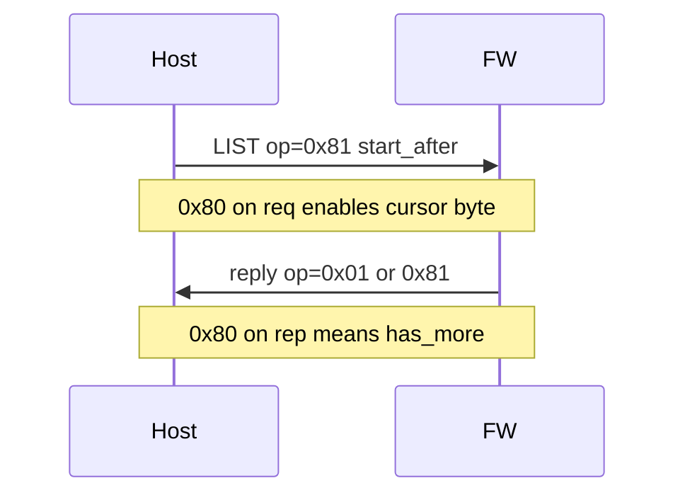

# Plan: Device-tree `LIST` paging (`OP` MSB)

This document records the agreed **v1-in-development** extension: page large sibling lists without requiring the host or firmware to materialize an unbounded UDP payload. It supersedes informal chat; implement when ready.

## Goal

- Bound **LIST reply size** when a level has few children but **large JSON metadata per row** (or many app actions).
- Keep the device **stateless** (no server-side cursor tables): the host passes a **cursor** on each request.
- **Drop** the requirement **`reply_op == req_op`**: the reply `op` byte may differ from the request (bit7 meaning changes between REQ and REP).

## Protocol semantics

### `op` byte encoding

- **Bits 6:0 (`op & 0x7f`)**: base opcode (`LIST = 0x01`, enum unchanged).
- **Bit7 `0x80` on `LIST` requests**: **paging / cursor mode** enabled.
  - Request **`op_payload` MUST be exactly 1 byte**: `start_after` (`u8`).
  - Device lists **direct children** at `(node_depth, node_location)` and resumes after the sibling whose `node_id == start_after` in firmware wire order.
- **Bit7 `0x80` on `LIST` replies**: **`has_more`** — reply was **truncated** at an item boundary because the encoded list would exceed the firmware response buffer / framing limit; more siblings remain after the last returned item.
  - Reply **`op` = `(0x01 | (has_more ? 0x80 : 0))`** for LIST (i.e. base `LIST` | bit7). Other operations: **reply bit7 cleared** unless documented otherwise later.

### Non-paged `LIST` (backward compatible)

- Request **`op = 0x01`** and **`op_payload_len == 0`**: existing “return all direct children” behavior (still bounded by current `TREE_RESPONSE_MAX` / outer UDP limits in [`Firmware/Protocol/Src/proto_control_udp.c`](../../Firmware/Protocol/Src/proto_control_udp.c)).

### Paged `LIST`

- Request **`op = 0x81`** (`LIST | 0x80`) with **`op_payload` = one byte `start_after`**.
- Host loop: first call `start_after = 0`; each subsequent call while **`has_more`** set **`start_after` = last emitted child `node_id`** in the merged result (same deterministic order as firmware).

### Ordering note (normative for implementers)

Paging uses the **order the firmware emits children today** (insertion order into the internal list builder in [`Firmware/Resident/Src/resident_device_tree.c`](../../Firmware/Resident/Src/resident_device_tree.c)), **not** necessarily sorted by numeric `node_id`. The host must treat `start_after` as a **cursor in that wire order** (resume after the matching `node_id`), not as a global ID range.

## Documentation delta

**File:** [`docs/device-tree.md`](../device-tree.md)

- Add **`op` wire encoding** (REQ vs REP bit7).
- Update **LIST** section: non-paged vs paged payload rules; reply `op` and `has_more`; remove any implication that reply echoes full request `op`.
- Reference **max response** / `TREE_RESPONSE_MAX` so tooling knows why truncation occurs.

## Firmware delta

### Protocol layer

**File:** [`Firmware/Protocol/Src/proto_control_udp.c`](../../Firmware/Protocol/Src/proto_control_udp.c)

- Mask op for dispatch: `base_op = prefix->op & 0x7f`; `switch (base_op)`.
- **LIST**:
  - If `(prefix->op & 0x80)`: require `op_payload_len == 1`, read `start_after`.
  - Else: require `op_payload_len == 0` (reject ambiguous non-empty payload on `0x01`).
- Pass `start_after` and an out **`has_more`** into `resident_device_tree_list`.
- Set first reply body byte to **`base_op | (has_more ? 0x80 : 0)`** for LIST only; other ops write `base_op`.

### Resident list

**Files:** [`Firmware/Resident/Inc/resident_device_tree.h`](../../Firmware/Resident/Inc/resident_device_tree.h), [`Firmware/Resident/Src/resident_device_tree.c`](../../Firmware/Resident/Src/resident_device_tree.c)

- Extend `resident_device_tree_list` with **`start_after`** and **`bool *has_more`** (or equivalent).
- After resolving the sibling set, **emit items sequentially**; stop before exceeding **`response_max`**; set **`has_more`** if any siblings remain unencoded.

**RAM caveat (two phases):**

- **Phase A (smaller change):** paging + truncation + `has_more` while still building the current **`items[]` staging array** — fixes wire size and avoids huge UDP datagrams; **peak stack for `items[]` unchanged**.
- **Phase B (RAM goal):** refactor branches so siblings are **generated or emitted one-at-a-time** without a full `items[N]` staging buffer (larger refactor; needed if wide app action lists stress stack).

## Host TUI / Python

**Primary file:** [`tools/bootloader_cli.py`](../../tools/bootloader_cli.py)

- Plumb **`reply_op` from `inner_payload[0]`** (or equivalent) so callers can read **`has_more = (reply_op & 0x80) != 0`** for `DEVICETREE_REPLY`.
- **`list_device_tree_node`**: optionally use **`op=0x81`** and loop on `has_more`, concatenating items; cap max iterations defensively.
- **UI:** treat the child list as scrollable; optionally **window + prefetch** near list ends to limit host RAM.

**Optional:** extend [`tools/test_control_tree.py`](../../tools/test_control_tree.py) with flags to exercise paged LIST and print `has_more`.

## Checklist

1. [ ] Update [`docs/device-tree.md`](../device-tree.md) with `op` MSB rules, LIST payloads, pagination loop, ordering, limits.
2. [ ] Firmware: `proto_control_udp.c` — mask op, validate LIST payloads, set reply `op` with `has_more`.
3. [ ] Firmware: `resident_device_tree_list` — skip by `start_after`, truncate at item boundary, `has_more` (Phase A); schedule Phase B if stack must shrink.
4. [ ] Host: expose `has_more`; auto-paginate `LIST` in bootloader CLI (and optionally TUI viewport).
5. [ ] Smoke-test against a node that previously produced ~600B+ replies (e.g. Debug/Flash subtree).
