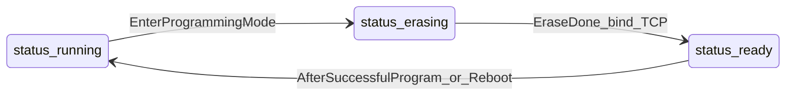

# Programming plan: TCP chunked flash updates

Chunked TCP flash programming is largely implemented in firmware today. This document captures the **target design** (SHA-1, device-tree-driven state, dynamic TCP port, boot-when-blank), gaps versus current code, and an implementation checklist.

## Requirements (locked in)

- **Checksums: SHA-1 only** — stream HELLO/FINISH fields where used, `AppImageHeader.sha1`, and `boot_image_validate` use **20-byte** digests. Protocol docs should standardize on SHA-1 (not SHA-256).
- **Authorization** — No lock for now (all nodes open). A **future lock** should gate `Enter programming mode` and optionally the TCP accept path.
- **Device tree (programming UX)** — Under a **top-level node** (name **TBD**; candidates: `fw`, `programming`, `firmware`):
  - **`status`** — Lifecycle values such as `running`, `erasing`, `ready`.
  - **`Programming TCP port`** — **-1** until the host should connect; in **`ready`**, the **actual** dynamic listen port (integer).
  - **`Enter programming mode`** (execute) — Stop the **application** (main + child threads via existing `app_stop`). **UDP control keeps running**. Move to **erasing**, run **app flash erase**; when blank, set **`ready`**, allocate a **free TCP port strictly above** resident UDP service port(s), **bind** the programming listener there.
- **Boot** — If app flash is **blank** on boot (no runnable app), enter **`ready`** and **bring up** the programming TCP listener using the same port rule.

## Current firmware vs target

| Area | Today | Target |
|------|--------|--------|
| TCP port | Fixed `PROG_PORT` (45002) in `proto_common.h` | Dynamic; first free listen port above UDP command ports |
| Listener | Started at boot in `proto_program_tcp_start` | Started when **`ready`** (including boot-blank); idle may show port **-1** |
| Erase | On `PROG_HELLO` after `boot_app_manager_stop` | Prefer **single erase** on “Enter programming mode”; align HELLO so it does not erase again |
| Discovery | `PROG_BEGIN_REQ` returns port | Host reads **`Programming TCP port`** from device tree; optionally keep `PROG_BEGIN_REPLY` as shortcut |
| Visibility | No DT state for erasing/ready | `status` + port leaf driven by central programming state |

## Delta work (firmware)

1. **Programming state machine** — Resident-owned enum/state: Running / Erasing / Ready (exact mapping when app valid but not started is TBD). Drive device-tree `status` and `Programming TCP port`.
2. **TCP lifecycle** — Bind listener only in **Ready**; define when to **close** listener (after FINISH/reboot vs stay open — TBD).
3. **Async erase** — Erase can be slow; run on a worker or chunk with yields so **UDP stays responsive**; transition to **Ready** only after erase succeeds.
4. **`proto_program_tcp.c`** — Match “erase on enter” UX: HELLO resets stream state / validates context without a second erase (preferred).
5. **`PROTO_MSG_PROG_BEGIN_REQ`** — Deprecate, mirror dynamic port from state, or leave for legacy hosts; unify with tree-based port discovery.

## Reuse (already in tree)

- Framed TCP protocol (HELLO / DATA ≤1000 / FINISH / ACK/NACK) in `Firmware/Protocol/Src/proto_program_tcp.c`.
- Flash helpers in `Firmware/Boot/Src/boot_flash.c`; image validation in `Firmware/Boot/Src/boot_image.c` (SHA-1).
- App stop + app device-tree unmount in `Firmware/Boot/Src/boot_app_manager.c`.

## Host tool

`tools/bootloader_cli.py` — **Write Program** should: trigger **Enter programming mode** if needed, **poll** the port leaf until not `-1`, **TCP connect**, send framed HELLO/DATA/FINISH with **20-byte** SHA-1 fields. If device booted blank and is already **ready**, skip enter when appropriate.

## Documentation updates

- `docs/programming.md` — SHA-1, dynamic port, **-1** sentinel, states, HELLO vs erase-on-enter.
- `docs/device-tree.md` — New subtree layout and semantics.
- `docs/commands.md` — Note `PROG_BEGIN` may become optional if the tree is canonical.

## Open details (implementation)

- Exact **`status`** strings for every situation (app running vs resident-only with valid image).
- **Top-level node name** (recommend short path, e.g. `fw`).
- **Listener teardown** policy after successful program.

## Optional hardening

- TCP **frame reassembly** in `program_recv` (LwIP may split frames or use chained pbufs).
- Enforce **max streamed bytes** vs HELLO `image_size` before flash write.

## State diagram

## Implementation checklist

- [ ] Confirm image file shape: packed `AppImageHeader` + payload vs raw `.bin` (raw needs pack step or new mode).
- [ ] Device tree: `status`, `Programming TCP port`, `Enter programming mode` execute; state machine + async erase.
- [ ] Replace fixed `PROG_PORT` with dynamic allocator above UDP service ports; document rule.
- [ ] Boot path: blank app region → `ready` + listener.
- [ ] Reconcile `PROG_BEGIN_REPLY` with tree port; update any host that used UDP-only discovery.
- [ ] Implement CLI **Write Program** (enter → poll port → TCP stream).
- [ ] Align `programming.md`, `device-tree.md`, `commands.md` with SHA-1 and new behavior.
- [ ] (Optional) TCP reassembly + size cap vs HELLO.
