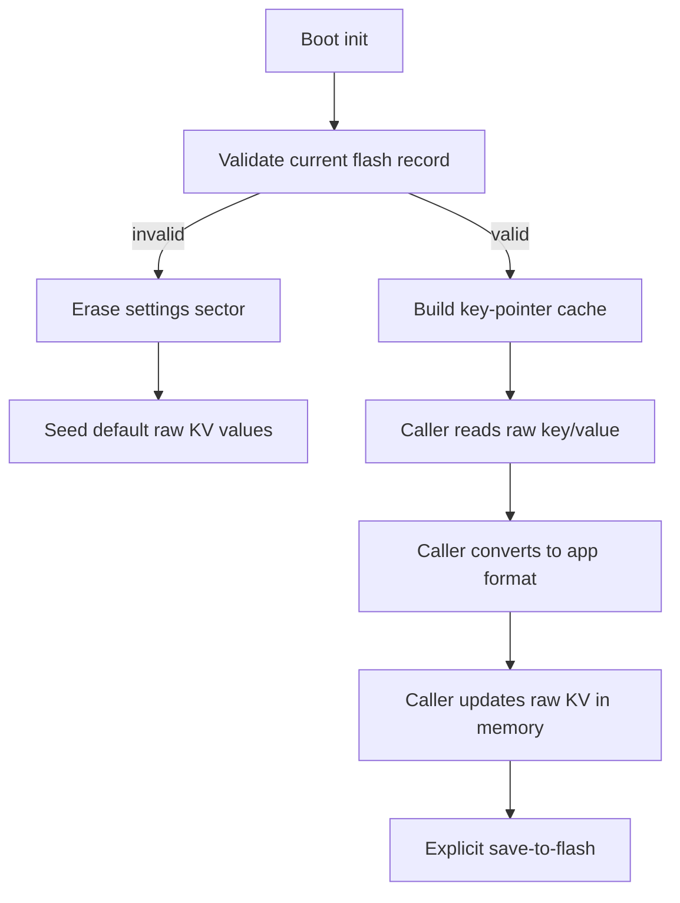

# Plan: Raw KV storage refactor

Refactor the boot metadata layer into a generic raw key/value store. Callers will own all type conversions and JSON formatting, while the storage core handles flash discovery, validation, caching, and save-to-flash persistence.

## Goals

- Remove application-specific knowledge from the KV storage layer.
- Make callers fully responsible for interpreting raw bytes, JSON text, and application formatting.
- Keep a single raw record format with version, CRC, and supporting integrity fields.
- Store each entry as:
  - key/node id
  - value length in bytes
  - raw value bytes
- Store JSON as a length-prefixed text blob in the raw value field.
- Add an initialization step that scans flash once, validates the active record, and builds a key/pointer cache.
- Cache every discovered key/value pointer pair so future lookups do not rescan from the start.
- If a requested key is not already cached, resume scanning from the last cached value and add each new entry to the cache as it is encountered.
- If no valid settings object is found at boot, resident firmware erases the sector and seeds default values.
- Do not preserve or migrate pre-existing settings; the test device will be flashed with erased storage.
- Keep settings in memory until an explicit save-to-flash call is made so callers can batch many updates into one flash write.
- Support JSON as a raw text blob with a length prefix inside the raw value payload.

## Current-state boundaries to change

- [`Firmware/Boot/Src/boot_metadata.c`](../../Firmware/Boot/Src/boot_metadata.c)
- [`Firmware/Boot/Inc/boot_metadata.h`](../../Firmware/Boot/Inc/boot_metadata.h)
- [`Firmware/Resident/Src/resident_device_tree.c`](../../Firmware/Resident/Src/resident_device_tree.c)
- [`Firmware/Resident/Inc/resident_device_tree.h`](../../Firmware/Resident/Inc/resident_device_tree.h)
- [`Firmware/Protocol/Src/proto_control_udp.c`](../../Firmware/Protocol/Src/proto_control_udp.c)
- [`Firmware/Resident/Src/resident_api.c`](../../Firmware/Resident/Src/resident_api.c)
- [`Firmware/AppAbi/app_api.h`](../../Firmware/AppAbi/app_api.h)
- `Firmware/LWIP/App/lwip.c`
- `Firmware/Resident/Src/resident_hardware.c`
- `Firmware/Boot/Src/boot_app_manager.c`
- `Firmware/Boot/Src/boot_fault.c`
- `Firmware/Protocol/Src/proto_discovery_udp.c`

## Proposed shape

## Implementation plan

### 1. Convert storage core to raw KV

- Replace schema-aware boot metadata decoding with a generic raw entry list.
- Preserve existing integrity fields such as version and CRC.
- Remove any requirement that the storage layer understand app-specific meanings.
- Keep the record append/save behavior, but make it operate on raw entries rather than typed fields.

### 2. Add initialization and pointer cache

- Add an init method that seeks the active flash object once and validates it.
- Populate an in-memory cache of key -> pointer/offset for each discovered entry.
- When a lookup misses the cache, continue scanning from the last known pointer and cache each entry encountered along the way.
- Make repeated reads avoid rescanning the whole object.

### 3. Make writes buffered in RAM

- Keep updates in memory after caller writes.
- Add a dedicated save-to-flash method that commits the buffered raw KV state in one shot.
- Let callers batch large operations and save only once.

### 4. Move formatting and conversion to callers

- Update resident, network, hardware, discovery, and program-facing code to read/write raw values and perform their own conversions.
- Keep the KV layer unaware of application-level formatting.
- Treat JSON as an opaque text blob in the storage layer.

### 5. Boot behavior

- On boot, try to read the settings object through the new init path.
- If the record is invalid, clear the sector and write defaults.
- Do not attempt compatibility migration from the old record format.

### 6. Update docs and device-tree expectations

- Document the raw record shape, length-prefixed JSON blob handling, and cache behavior.
- Update device-tree docs to describe the raw KV store as caller-owned data.

## Notes

- Existing flash contents do not need to be preserved for this device.
- The new format should be able to store arbitrary data without schema knowledge in the storage core.
- If the cache grows later, keep the fast path on the first discovered entry and only scan forward from the last known entry.

## Checklist

1. [ ] Redesign the boot metadata record codec as a raw KV list.
2. [ ] Add init + validation + key-pointer cache behavior.
3. [ ] Add explicit save-to-flash semantics for buffered writes.
4. [ ] Move all caller-side formatting/parsing out of the storage core.
5. [ ] Document the new format and cache behavior.
